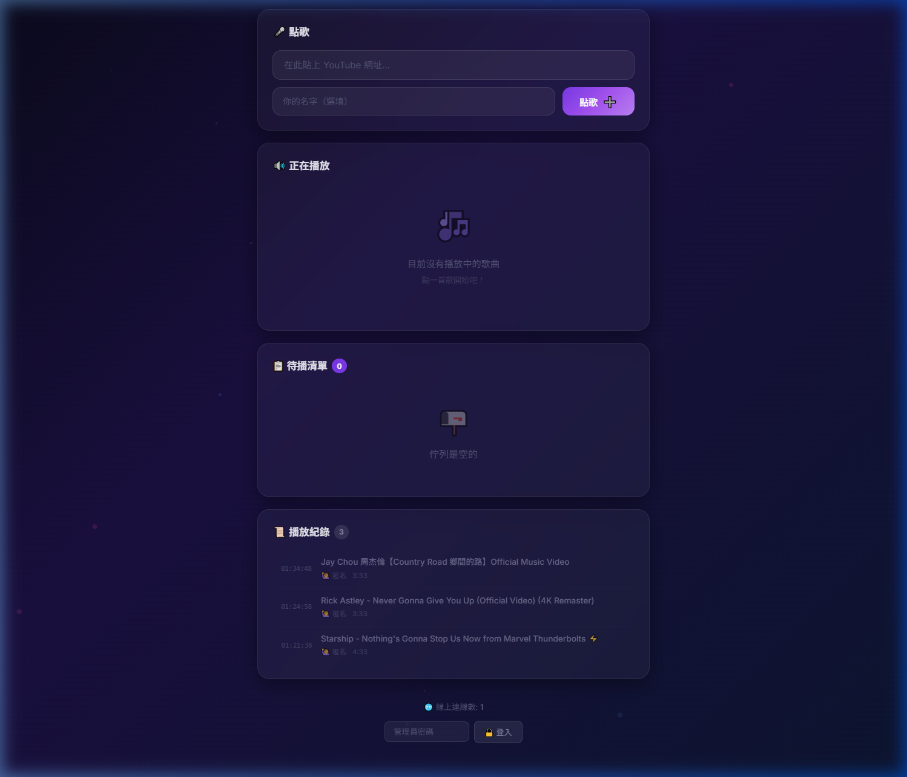
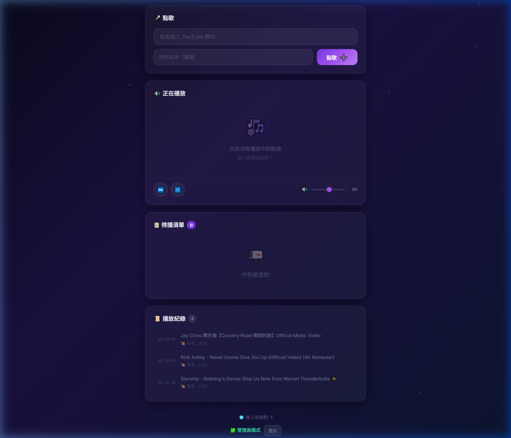

# 🎵 Music Station — YouTube 點歌系統

讓大家透過網頁點歌，音樂直接在你的電腦上播放！  
適合聚會、實況、店面背景音樂等場景。



## ✨ 功能特色

- 🎤 **線上點歌** — 任何人在瀏覽器貼上 YouTube 網址即可點歌
- 🔊 **主機播放** — 音樂在伺服器主機的喇叭播放
- 📋 **歌曲佇列** — 自動排隊、自動播下一首
- 📜 **播放紀錄** — 保留已播放過的歌曲紀錄（重啟不消失）
- 🔒 **管理員控制** — 跳過、暫停、音量調整、移除歌曲（需密碼登入）
- ⏱️ **時長限制** — 可設定歌曲最長幾分鐘
- 🌐 **即時同步** — WebSocket 即時更新所有連線者的畫面
- 📱 **手機友善** — 響應式設計，手機也能輕鬆點歌

### 管理員模式

輸入密碼登入後，會顯示控制列（跳過、暫停、音量）：



---

## 📦 系統需求

| 項目 | 說明 |
|------|------|
| Python | 3.6.7 或以上 |
| mpv | 音樂播放器 |
| yt-dlp | YouTube 影片解析工具 |
| 作業系統 | Windows |

---

## 🚀 安裝與設定

### 步驟 1：下載專案

```bash
git clone https://github.com/<你的帳號>/MusicServer.git
cd MusicServer
```

---

### 步驟 2：建立 Python 虛擬環境

```bash
python -m venv venv
```

啟動虛擬環境：

```bash
# Windows PowerShell
.\venv\Scripts\Activate.ps1

# Windows CMD
.\venv\Scripts\activate.bat
```

安裝依賴：

```bash
pip install tornado
```

---

### 步驟 3：安裝 mpv 播放器

1. 前往 **mpv 官方下載頁面**：  
   👉 https://mpv.io/installation/

2. Windows 使用者建議下載 **shinchiro** 版本：  
   👉 https://sourceforge.net/projects/mpv-player-windows/files/

3. 下載後解壓縮到你想要的位置，例如：
   ```
   D:\Tools\mpv\
   ```

4. **將 mpv 資料夾加入系統 PATH**：
   - 按 `Win + S` 搜尋「環境變數」
   - 點選「編輯系統環境變數」
   - 點「環境變數」→ 選「Path」→「編輯」→「新增」
   - 加入 mpv 的路徑，例如 `D:\Tools\mpv`
   - 確定儲存

5. 驗證安裝：
   ```bash
   mpv --version
   ```
   看到版本資訊就代表成功 ✅

---

### 步驟 4：安裝 yt-dlp

1. 前往 **yt-dlp 發布頁面**：  
   👉 https://github.com/yt-dlp/yt-dlp/releases/latest

2. 下載 `yt-dlp.exe`

3. 將 `yt-dlp.exe` 放到 **mpv 同一個資料夾**（或任何已在 PATH 中的資料夾）

4. 驗證安裝：
   ```bash
   yt-dlp --version
   ```
   看到版本號就代表成功 ✅

---

### 步驟 5：設定（選填）

用文字編輯器打開 `server.py`，可修改以下設定：

```python
PORT = 8888                # 伺服器埠號
ADMIN_PASSWORD = 'admin'   # 管理員密碼（建議修改！）
MAX_DURATION_MINUTES = 10  # 歌曲時長限制（分鐘），設 0 不限制
```

---

## ▶️ 啟動伺服器

```bash
# 確保已啟動虛擬環境
.\venv\Scripts\Activate.ps1

# 啟動
python server.py
```

啟動成功會看到：

```
00:00:00 [INFO] ==================================================
00:00:00 [INFO]   🎵 YouTube 點歌系統
00:00:00 [INFO] ==================================================
00:00:02 [INFO] mpv 已啟動 (PID: 12345)
00:00:02 [INFO] 伺服器已啟動: http://localhost:8888
00:00:02 [INFO] 區域網路存取: http://<你的IP>:8888
```

---

## 🌐 開始使用

### 本機使用
打開瀏覽器，前往：
```
http://localhost:8888
```

### 區域網路（讓其他人連線）
1. 查看你的 IP 位址：
   ```bash
   ipconfig
   ```
   找到 `IPv4 位址`，例如 `192.168.1.100`

2. 告訴其他人用瀏覽器開啟：
   ```
   http://192.168.1.100:8888
   ```

> ⚠️ **注意**：如果其他人連不上，可能需要在 Windows 防火牆開放 8888 埠。

---

## 🔒 管理員操作

1. 在網頁最底部找到密碼輸入框
2. 輸入管理員密碼（預設 `admin`）
3. 點擊「🔒 登入」
4. 登入後即可使用：
   - ⏭️ 跳過當前歌曲
   - ⏸️ 暫停 / ▶️ 繼續
   - 🔊 音量調整
   - ✕ 移除佇列中的歌曲

---

## 📁 專案結構

```
MusicServer/
├── server.py          # 主伺服器程式
├── static/
│   ├── index.html     # 前端頁面
│   ├── style.css      # 樣式表
│   └── app.js         # 前端邏輯
├── docs/
│   ├── screenshot_user.png   # 使用者介面截圖
│   └── screenshot_admin.png  # 管理員介面截圖
├── requirements.txt   # Python 依賴
├── data.json          # 佇列與播放紀錄（自動產生）
└── README.md          # 本文件
```

---

## ❓ 常見問題

### Q: 啟動時顯示「找不到 mpv」
確認 `mpv.exe` 所在資料夾已加入系統 PATH，並重新開啟終端機。

### Q: 點歌後顯示「無法取得影片資訊」
確認 `yt-dlp.exe` 已安裝且在 PATH 中。部分影片可能有地區限制。

### Q: 區域網路內其他人連不上
- 確認在同一個網路內
- 檢查 Windows 防火牆是否有阻擋 8888 埠
- 嘗試暫時關閉防火牆測試

### Q: 歌曲超過時長限制被拒絕
修改 `server.py` 中的 `MAX_DURATION_MINUTES`，設為 `0` 即不限制。

---

## 📜 授權

MIT License
